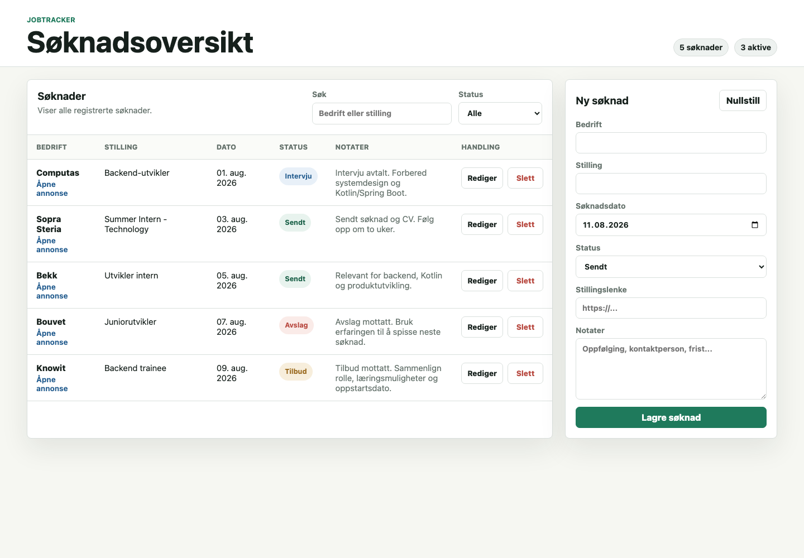

# JobTracker

JobTracker er en enkel webapp og REST-API for å holde oversikt over jobbsøknader. Den lar deg registrere bedrift, stilling, søknadsdato, status, stillingslenke og notater, og passer som et lite porteføljeprosjekt for Kotlin/Spring Boot med PostgreSQL.



## Funksjoner

- Registrer nye jobbsøknader
- Se alle søknader i en ryddig tabell
- Søk på bedrift eller stilling
- Filtrer på status: `SENT`, `INTERVIEW`, `REJECTED`, `OFFER`
- Rediger eksisterende søknader
- Slett søknader
- REST-API under `/api/applications`
- Validering og tydelige `400`/`404`-feilsvar

## Teknologistack

- Kotlin
- Spring Boot 3.3
- Spring Web
- Spring Data JPA / Hibernate
- PostgreSQL
- Gradle Kotlin DSL
- HTML, CSS og JavaScript

## Kjøre lokalt

### 1. Start PostgreSQL

```bash
docker run --name jobtracker-db \
  -e POSTGRES_PASSWORD=devpass \
  -e POSTGRES_DB=jobtracker \
  -p 5432:5432 \
  -d postgres:15
```

Hvis containeren allerede finnes:

```bash
docker start jobtracker-db
```

### 2. Start appen

```bash
./gradlew bootRun
```

Åpne webappen:

```text
http://localhost:8080/
```

API-et ligger her:

```text
http://localhost:8080/api/applications
```

Databasetabellen opprettes automatisk ved oppstart med `spring.jpa.hibernate.ddl-auto=update`.

## Deploy

Repoet inneholder `Dockerfile` og `render.yaml`, slik at appen kan deployes på Render som en Blueprint med én webservice og én PostgreSQL-database.

1. Åpne Render Dashboard.
2. Velg **New** → **Blueprint**.
3. Koble til dette GitHub-repoet.
4. Velg `render.yaml`.
5. Deploy Blueprint.

Render oppretter Postgres-databasen og sender database-URL-en til appen som `DATABASE_URL`. Appen konverterer automatisk Render sin `postgresql://...`-URL til Spring Boot sin JDBC-format ved oppstart.

## Datamodell

| Felt | Type | Påkrevd | Beskrivelse |
| --- | --- | --- | --- |
| `id` | Long | auto | Genereres av databasen |
| `companyName` | String | ja | Navn på bedriften |
| `jobTitle` | String | ja | Stillingstittel |
| `applicationDate` | LocalDate | ja | Dato søknaden ble sendt |
| `status` | enum | ja | `SENT`, `INTERVIEW`, `REJECTED`, `OFFER` |
| `jobListingUrl` | String | nei | Lenke til stillingsannonsen |
| `notes` | String | nei | Fritekstnotater |

## API

Alle endepunkter ligger under `/api/applications`.

| Metode | Endepunkt | Beskrivelse |
| --- | --- | --- |
| `GET` | `/api/applications` | Hent alle søknader |
| `GET` | `/api/applications/{id}` | Hent én søknad |
| `POST` | `/api/applications` | Opprett søknad |
| `PUT` | `/api/applications/{id}` | Oppdater søknad |
| `DELETE` | `/api/applications/{id}` | Slett søknad |

### Eksempel: opprett søknad

```bash
curl -X POST http://localhost:8080/api/applications \
  -H "Content-Type: application/json" \
  -d '{
    "companyName": "Computas",
    "jobTitle": "Backend-utvikler",
    "applicationDate": "2026-08-11",
    "status": "SENT",
    "jobListingUrl": "https://example.com/job/123",
    "notes": "Søkte via finn.no"
  }'
```

### Statuskoder

- `200 OK` ved vellykket `GET` og `PUT`
- `201 Created` ved vellykket `POST`
- `204 No Content` ved vellykket `DELETE`
- `400 Bad Request` ved valideringsfeil
- `404 Not Found` når søknaden ikke finnes

## Lisens

MIT License. Se [LICENSE](LICENSE).
